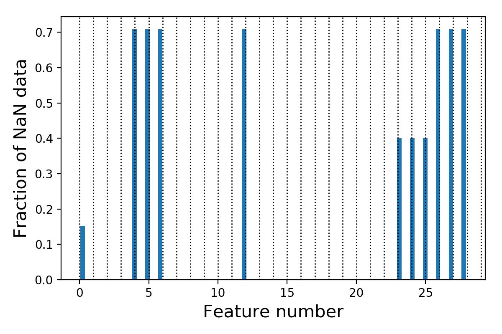
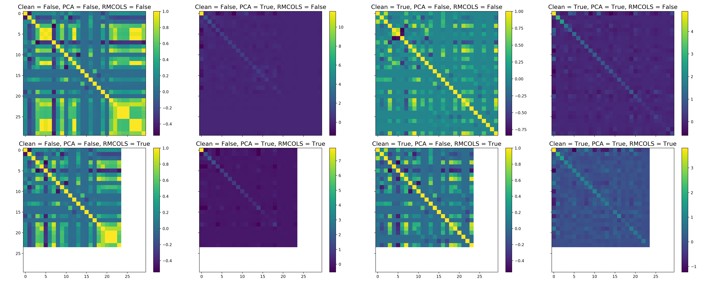

# ml-project1
First project of the ML course at EPFL, Autumn 2019.\
Various code snippets were taken from the helper functions provided in the course [lab](https://github.com/epfml/ML_course).\
This code implements different machine learning techniques to classify ATLAS events into the classes of `s` (signal) and `b` (background) to a higgs boson production event.
# Project Outline
```
data
    sample_submission.csv
    test.csv
    train.csv
doc
    implementations.html
    preprocessing.html
    tests.html
    proj1_helpers.html
plots
    nan_fraction.png
    preprocessing_cases_covmat.png
    preprocessing_pca_cases_explvar.png
results
    *many resulting files from testing. These follow a convention cv_method_d(degree)_cl(clean)_pca(dopca)_rmcols(remove_columns)[stdafter(stdafter)].xxx*
scripts
    implementations.ipynb
    implementations.py
    plots.ipynb
    preprocessing.py
    proj1_helpers.py
    project1.ipynb
    run.py
    tests.py

```

# Modules
***The documentation for all modules can be accessed from the command line via `pydoc module_name` or is available in `html` format in the `doc` directory***


The file `scripts/implementations.py` contains the module `implementations `, which stores the methods to implement: `least_squares_GD, least_squares_SGD, least_squares, ridge_regression, logistic_regression` and `reg_logistic_regression`. The logistic regression algorithms use gradient descent given that the stochastic variant performs slower (though it is implemented for the non-penalized logistic regression).\
The module also contains fuctions necessary for the implementation of these algorithms like the computation of the loss functions and gradients.

The functions in this module do partially follow the signature provided. Additional parameters are accepted but have default values. See more detailed description in the documentation files for each module.

The file `scripts/preprocessing.py` contains all the functions used for preprocessing the data. 

The file `scripts/run.py` trains our best model and predicts on the `test.csv` data. Output is written in the current directory to avoid errors in the automatic testing of the functions.

The file `scripts/tests.py` contains the functions that implement cross validation and the parameters used in the testing, including the `gamma` values for each method. These can be imported via `from tests import *`. The dictionaries `args_rr`, `args_gd`, `args_sgd `, `args_lsq`, `args_lrgd` and `args_rlrgd` contain the keyword parameters to the respective methods to allow function calls such as:
```python
weight, loss_tr = method(y_train, tx_train, **method_args)

```
This module is built such that it can be imported as usual but could also be run as a standalone script which will perform various tests. This version is suitable for a serial run, which is *not recommended* , given that it would take too much time. The actual tests were run in an embarrasingly parallel fashion.

The file `scripts/proj1_helpers.py` contains some helper functions provided beforehand (to import the data, for instance) as well as some additions of our own.

# The Data

The data comes from The Higgs boson machine learning challenge, where it was provided by the ATLAS experiment. The full explanation of that challenge and of each of the features is availiable [here](https://higgsml.lal.in2p3.fr/files/2014/04/documentation_v1.8.pdf).\
It consists of 30 features that combine both *primitive* and *derived* values, meaning that the latter come from the former. The first column is the event `ID`, which identifies the sample, the second column is the label `s` for signal (the event corresponds to a higgs) and `b` for background (the event does not correspond to a higgs but to a process with a similar signature). The remaining columns correspond to the features.

# Preprocessing

The `preprocessing` module contains the necessary functions used to prepare the data for modelling (see the documentation in [`preprocessing.html`](doc/preprocessing.html)). Various tests were performed regarding the preprocessing varying in the way we treat the missing values (also referred to as `NaN` values) and the treatment of correlations in the original data.\
The following figure shows the fraction of values that are `NaN = -999` in each feature.\
\
It is evident that some features have as much as 70% of their content missing. Additionally, we found that the missing values are the same (all related to `PRI jet num < 2`) which introduces high correlations between the data as can be seen below (top left panel).


## Importing
When importing the data, the provided function casts the `s` and `b` labels into `1` and `-1`.
## Cleaning
The data was "cleaned" of `NaN` values by imputing with the mean. The correlations are mostly "corrected" by this single process as can be seen in the figure above, top third panel.
This is done by the function `clean_data`
## Standardization
Data is standardized by feature using function `standardize_feature`. Note that standardizing after cleaning yields columns of mostly zeros.
## Column removal
We tested the model removing all but one of the 6 columns with high fraction of missing values, we expect this procedure to allow us to keep the information commonly enconded in the colums and diminish the computational load. This is done by the `preprocess` function. Note that in the final submission this step was *not applied*.
## Principal Component Analysis (PCA)
We experimented with PCA to extract a set of features that maximised the variance and allowed us to build a model over an orthogonal set of features. However, after testing the model, the performance was unsatisfactory and this too *was not used in the final submission*
## Feature expansion
We performed polynomial feature expansion and added an offset column to the design matrix. The `degree` was chosen based on various tests to be `degree = 10` for the "exact" algorithms and `degree = 2` for the iterative ones. In the latter, we could also have used `degree=10` prodived that we re-standardized the design matrix after the expansion, however, the resulting model was negligibly better than the `degree=2` but was considerably more comutationally expensive. The re-standardization was necessary given that the iterative algorithms yield infinite losses for such high degrees.
## Summary of preprocessing
In the end, after thorough testing, we decided to clean (impute), standardize and expand features up to degrgee 10 for the exact algorithms and up to 2 for the iterative ones. It is worth noting that for the two logistic regression methods, the labels were cast into `1` and `0` to follow the convention seen in the course lectures. There are functions  `compute_loss_logistic_new` and `compute_gradient_logistic_new` that can handle the original `1` and `-1` labels.

# Model Selection
To test the different models we performed 4-fold cross validation in all of them (see `tests` module [documentation](doc/tests.html)). The parameters therein were obtained after individual small-scale tests for convergence of the methods when using different values.\
When necessary (`ridge_regression` and `reg_logistic_regression`), a grid search in the hyperparameter `lambda_` was performed. 


